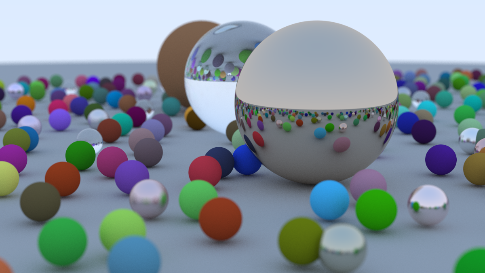
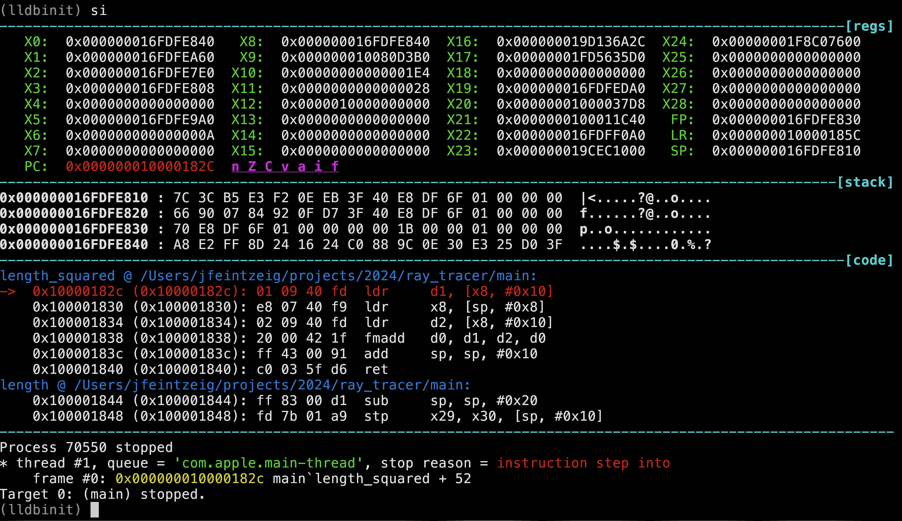
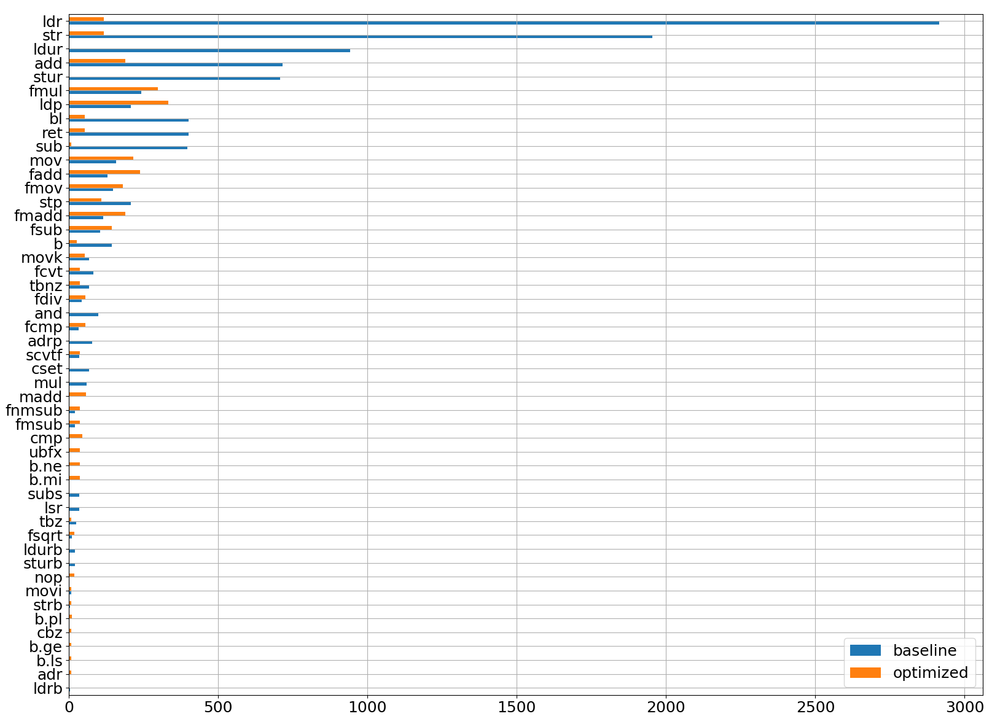

Inspired by others at the Recurse Center, I recently built a ray tracer by working through the excellent book *[Ray Tracing in a Weekend](https://raytracing.github.io/books/RayTracingInOneWeekend.html)*. I've been learning C and was attracted to this project because it was complex enough to be interesting but small enough to be time-constrained (my implementation is ~1,000 lines of code); there's minimal dependencies so I can focus on learning C instead of learning APIs; and the end result is a pretty picture:

*Cover image of Ray Tracing in a Weekend, rendered by my implementation.*

I was excited to create this magical, photorealistic image but was completely surprised at how *slow* my program was. Rendering this image required 3+ hours of wall-clock time on my fancy new MacBook Pro.

I didn't know what to expect, but that sure felt slow. I wanted to make it faster. I pair programmed with a couple people and they quickly pointed out a very simple solution: I was not passing any optimization level flags to the compiler. We added `-O2` to my `Makefile`, and my program was suddenly 15x faster.

This **shocked** me! The computer *knew*. It knew its default behavior was slow and shitty and it had a literal "make it go faster" button. What was it *doing*? I had a mental model of how my C code translated into low-level CPU operations, and I did not understand how something as seemingly benign as a compiler flag could make such a huge difference. I wanted to understand. I did some googling, and chatGPT'ing, and found vague answers referring to inlining and loop unrolling but I didn't have a strong intuition for how much that mattered or how they applied to my program. I found [a list](https://gcc.gnu.org/onlinedocs/gcc/Optimize-Options.html) of the ~50 flags that go into each optimization level, and I iteratively benchmarked my code with each flag turned on or off, but it didn't replicate the overall speedup (and I [later read](https://stackoverflow.com/questions/60386091/what-exactly-is-the-difference-between-various-optimization-levels-in-gcc-g) that those flags only make up a subset of what `-O2` does).

So I took things into my own hands. The first thing I did was look at my program's disassembly:


objdump -d my_ray_tracer | less


The optimized version was ~2200 lines of assembly while the unoptimized was ~3500. 60% less code is significant! But also not 15x. So I opened it up and tried to read what it said.

Unfortunately for me, I had never looked at arm64 assembly before. I felt I had a reasonable grasp of assembly because I'd recently spent 150 hours working through a binary reverse engineering CTF ([microcorruption](https://microcorruption.com/), it's the best), but this was foreign. I tried reading documentation but quickly got bored, so I instead took another cue from microcorruption and began to interact with my program dynamically. I opened it up in `lldb`, a `gdb`-like debugger for Mac. Microcorruption's UI was such an effective learning tool that I wanted to replicate it, and I luckily found [lldbinit](https://github.com/gdbinit/lldbinit), an `lldb` extension that gives you a view of the disassembly, the original source code (if you compile with debugging symbols), and the registers. As you step through instruction-by-instruction, you can see which registers change and how.

*Snapshot of `lldbinit`, showing the registers, stack memory, and disassembly.*

I first focused on the smallest functions in my program, simple things that multiply or subtract vectors, and stepped through the debugger for both versions. I expected these functions to purely consist of math operations, but the unoptimized version was inundated with load and store instructions. I wasn't sure if this was widespread, or if these functions were called ten times or a billion times. I needed to collect more data.

Luckily, `lldb` is completely scriptable. You can write Python code to plug into a [broad swath of its functionality](https://lldb.llvm.org/use/python-reference.html). So I googled some more and copied some example code and made a plugin that logged every executed instruction to a file. I set breakpoints around the innermost loop of my ray tracer, propagated a handful of rays in the optimized and unoptimized versions, and made a histogram of the output.

*Y-axis shows instruction, X-axis shows \# of executions during 5 iterations of the innermost loop. The unoptimized version is in blue, orange is the same code compiled with `-O2`.*

It turned out the unoptimized version was *mostly* doing loads and store operations (`ldr`, `ldur`, `str`, `stur`), 10x more frequently than the optimized version. When I looked back at the disassembly, I could see this happening everywhere&mdash;at the beginning and end of function calls, in between arithmetic operations, seemingly for no reason. Similarly, instructions associated with function calls (`b`, `bl`, `ret`) were 10x more frequent in the unoptimized version. While I knew "function inlining" was a thing and it made programs faster, I was surprised by the sheer proportion of instructions that were apparently filler.

Some instructions were *more* common in the optimized version. I'm not sure why the optimized version is doing more floating-point math, but the higher prevalence of `ldp` instructions looked like a small win: instead of loading one value at a time, this instruction loads two values into a pair of registers at once.

With this high-level understanding, I could now make more sense of the assembly. At a high-level, my ray tracer has four nested for-loops. The innermost loop, a short math routine to calculate whether a ray hits a sphere, is executed a trillion times and dominates the run time. This is what it looks like in C:


point3_t center = sphere->center;
double radius = sphere->radius;
vec3_t a_c = subtract(r->origin, center);
double a = length_squared(&r->direction);
double half_b = dot(r->direction, a_c);
double c = length_squared(&a_c) - radius*radius;
double discriminant = half_b*half_b - a*c;
if (discriminant < 0) {
  return false;
} else {
   // do stuff
}


Here is the disassembly (arm64, intel syntex) after compiling it with `-O2`:


ldp     d25, d22, [x13, #-40]!
ldp     d23, d24, [x13, #16]
fsub    d19, d1, d25
fsub    d27, d2, d22
fsub    d28, d4, d23
fmul    d26, d27, d6
fmadd   d26, d5, d19, d26
fmadd   d26, d0, d28, d26
fmul    d27, d27, d27
fmadd   d19, d19, d19, d27
fmadd   d19, d28, d28, d19
fmsub   d19, d24, d24, d19
fmul    d19, d19, d16
fmadd   d19, d26, d26, d19
fcmp    d19, #0.0
b.mi    0x1000033c0 <_ray_color+0x88>


To get oriented I've highlighted the subtract call in both. This assembly is roughly how I imagined my C code was being executed: we load the sphere's coordinates into registers (`ldp`), and we start subtracting and multiplying those registers (`fsub`, `fmul`). Great.

However, here is a snippet of assembly after compiling the same C code *without* optimization (the `subtract()` function call is again highlighted):


sub     sp, sp, #288
stp     x20, x19, [sp, #256]
stp     x29, x30, [sp, #272]
add     x29, sp, #272
stur    x0, [x29, #-32]
stur    x1, [x29, #-40]
stur    x2, [x29, #-48]
stur    x3, [x29, #-56]
ldur    x8, [x29, #-32]
ldr     q0, [x8]
ldr     x8, [x8, #16]
stur    x8, [x29, #-64]
stur    q0, [x29, #-80]
ldur    x8, [x29, #-32]
ldr     d0, [x8, #24]
stur    d0, [x29, #-88]
ldur    x8, [x29, #-40]
ldr     d2, [x8, #16]
ldr     d1, [x8, #8]
ldr     d0, [x8]
ldur    d5, [x29, #-64]
ldur    d4, [x29, #-72]
ldur    d3, [x29, #-80]
bl      0x1000018dc <_subtract>
stur    d2, [x29, #-96]
stur    d1, [x29, #-104]
stur    d0, [x29, #-112]
ldur    x8, [x29, #-40]
add     x0, x8, #24
bl      0x1000017f8 <_length_squared>
; ...much more code below here...


This is a mess! While the optimized version required 16 instructions for the entire routine, this version takes 24 just to get to the subtract call. Before that we see a function prologue, a series of loads and stores of certain registers. Inlining optimizes all of this away. Then there are more loads and stores until finally the subtract function is called (not inlined, so it will have its *own* function prologue, etc.). And most interestingly, in between each operation (`subtract(), `length_squared()`) it stores the result to memory and loads the next value, which will be slow. When the compiler optimizes, it somehow identifies the most-used variables and keeps them in registers, avoiding unnecessary memory reads/writes.

I later learned that `clang` is happy to tell you all about the optimizations it does if you pass it the flags `-Rpass=.*` and `-fsave-optimization-record=yaml`. But this investigation gave me a much stronger intuition for what these optimizations do and why they work. And it also gave me ideas for more speed-ups: I know SIMD is a thing, but I don't see it being used here (except perhaps the `ldp` instruction to load a pair of values?).

Can we use SIMD to make this go faster?
