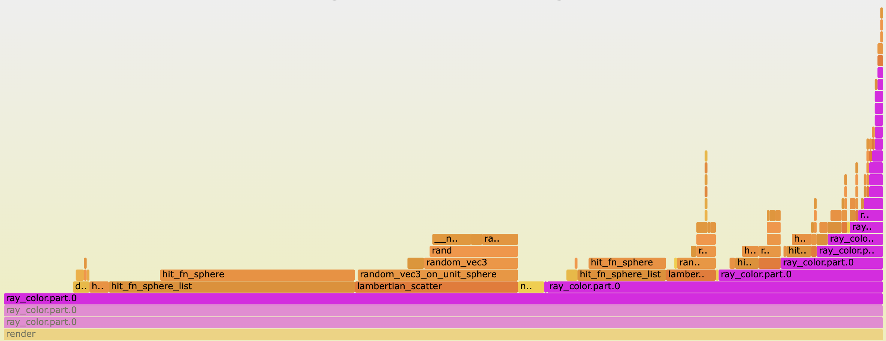

Since I learned about [compiler optimization levels](), I've gone down a deep rabbit hole of CPU performance optimization to make this ray tracer faster. I've implemented multi-threading and SIMD. I've learned about instruction-level-parallelism and CPU pipelines and memory hierarchy. I've read instruction timing tables and disassembled and reassembled.

I've made a lot of changes that I thought were really clever but instead made my program slower. I've also made some changes that I didn't think would make a difference but led to significant gains.

In this latter category, the most surprising change was refactoring a recursive function to a `while` loop, which sped up the entire program by 1.5x. After sweating over every little instruction in the core loop, this small change to an outer function only required a few lines of code and felt unremarkable. The recursive function called itself at the end of a specific block (line 5):



color_t ray_color(const ray_t *r, int depth, ...) {
  // ... logic removed for clarity ....
  if (hit_sphere_list_vectorized(sphere_list, ...)) { // expensive
    if (scatter(rec.mat, r, &rec, &new_attenuation, &nray)) {
      return ray_color(&nray, depth - 1, ...);
    }
    // ... moar logic
  }
}



I refactored this to use a `while` loop that depends on `depth`:



color_t ray_color(const ray_t *r, int depth, ...) {
  // ... logic removed for clarity ....
  while (depth > 0) {
    if (hit_sphere_list_vectorized(sphere_list, ...)) { // expensive
      if (scatter(rec.mat, r, &rec, &new_attenuation, &nray)) {
        attenuation = // biz logiz
        depth -= 1;
      } else {
        // ... moar logic
        return;
      }
    }
  }
}



With this change, the program wasn't really doing less&mdash;it was still tracing the same number of rays through the same number of scatters, doing the same number of calculations and nearly the same number of instructions. It was just organizing these operations in a different way. How could this lead to such a big speed-up?

Looking at the disassembly did not help me here because the two versions of the code were so similar. Instead I relied on performance counters to understand what the computer was doing. Hardware performance counters are some sort of low-level hardware feature&mdash;are they registers?&mdash;that keep track of how often certain events occur: cycles, instructions, branches, etc. On Linux you can access these counters to profile a process using `perf`. I've been doing most my work on a M2 MacBook Pro, which has a gui-based program called `Instruments` for performance tuning.

I've found `Instruments` to be somewhat under-documented [^0] but it has a lot of awesome functionality. It provides an interface to use CPU counters to count all sorts of low-level events: cycles, instructions by type (integer, memory accesses, floating-point), cache misses, reads of unaligned memory addresses, pipeline stalls, branch mispredictions. This was the first time I did any serious profiling, and I struggled to interpret the numbers. Branch mispredictions can slow things down, sure, but if my program has 15 million of them is that bad? It was hard to understand what was a "good" number vs. a "bad" number and how to isolate the bottlenecks.

At first I tried normalizing the counters to create metrics like "% of branches that were mis-predicted" and "% of loads that missed the L1 cache" but I couldn't make sense of the results. Then I realized that since I already stumbled on the *solution* (removing recursion) and now just had to understand the *problem*, I could just run every counter under both versions and compare the results.

Doing this, I noticed a few interesting things:

|                             | With Recursion | Without Recursion |
| --------------------------- | -------------- | ----------------- |
| Runtime                     | 57 seconds     | 37 seconds        |
| Instructions / cycle        | 1.8            | 2.5               |
| Floating Point uops / cycle | 2.0            | 3.0               |
| L1 Cache Misses (M)         | 2,927          | 33                |
| L2 TLB Miss (M)             | 77             | 0.5               |
| Pipeline Stalls (B)         | 760 (53%)      | 322 (34%)         |

The first is that the \# of instructions / cycle increased from 1.8 to 2.5. My program is faster not because it's executing fewer instructions, but because it's executing those instructions more efficiently. Other similar metrics, such as the \# of floating point micro-operations (uops) per cycle and the \# of pipeline stalls, showed similar improvements. The 1.5x increase in FP uops/cycle basically matches the overall 1.5x speed-up, showing the program is primarily constrained by FP operations. 

The second interesting thing is the \# of L1 cache misses dropped dramatically, by a factor of 90x. Other memory metrics had similar drops: L2 TLB misses dropped by 150x and the \# of load/store micro-operations that crossed a 64-byte boundary dropped by 220x. While I'd once learned the concept of memory hierarchy, I'd never worked through a real problem that required this knowledge. Could this be my bottleneck? These were the only metrics I could find that had such significant changes. On [this cool website](https://www.7-cpu.com/cpu/Apple_M1.html) I learned that accessing the L2 cache takes an extra 15 cycles compared to the L1 cache on Apple Silicon[^1]. So 2.9B L1 cache misses corresponds to ~15 seconds of time savings. This seemed to match up[^2].

But I was confused because my M2 Pro has 128kb of L1 cache space per core, much bigger than any of the data sizes I estimated for my program. My main loop iterates over 8kb of data (~500 spheres containing 4 floats each), and then indexes into another 8kb array containing the sphere's material. While the overall image is ~10MB, the program accesses the pixel buffer very rarely (a million times less frequently than the sphere array) and it fully renders a single pixel before moving on. There's certainly some other memory overhead floating around, but nothing gets close to the cache size.

However, recursive functions create a new stack frame for each function call. This was pointed out to me early on by someone I paired with at the Recurse Center, but we'd refactored the function to be [tail-call recursive](https://en.wikipedia.org/wiki/Tail_call). We'd assumed the compiler would optimize this out, and I hadn't thought of it again. But that turned out not to be the case, and in fact the profiles I'd been staring at showed the stack trace getting deeper and deeper with each recursive call.

*A flamegraph showing a profile of the recursive version. Each purple bar is another recursive function call and adds 100 bytes of stack memory.*

To understand how this increased the program's memory footprint, I hopped into `lldb` and kept track of the frame pointer. Each stack frame in this function was ~100 bytes. This again felt okay&mdash;while this function had some large parameters, I was passing them all by reference so they weren't copied. My program makes 50 recursive calls max, adding up to ~5kb. This is something, but it's still much smaller than the L1 cache. This confused me for a while.

On a whim I decided to repeat this profiling exercise with the program running on a single thread instead of 10 parallel threads. This revealed the last major clue: getting rid of the recursive function had almost no impact on performance when running single threaded. I didn't understand this immediately but I asked around until someone pointed out the answer: each thread gets its own stack.

I'd completely overlooked how multithreading and multicore would complicate execution. Each thread gets its own stack, so if I ran 10 threads the 5kb of extra stack memory was actually 50kb. That's *still* not 124kb, but someone else reminded me that my Mac's cores are not homogenous. It has 6 "performance cores", each with 124kb of L1 cache, and 4 "efficiency cores", each with 64kb of L1 cache. With the 50kb of stack frames, 16kb of spheres, and other overhead, this would easily spill out of the cache on an efficiency core.

This mostly explains it. But I am **still** a bit confused because I imagined each thread would only need to access it's own stack space, so any one core wouldn't load *every thread's* stack into the cache. This partly assumes each thread would run on a single core for the duration of the program, which isn't true. More profiling showed the operating system actually moves threads to different cores all the time[^3]. When a thread is moved there's a context switch, which causes that core to access data it hadn't used recently and is probably not in the cache. I'm not sure this happens often enough to explain the 2.9B L1 cache misses. Maybe the smaller cache size on the efficiency cores explains everything, or maybe each CPU is jumping around in stack memory more than I think. I did not fully map out the memory space usage of each thread.

After all this, I went back to the performance counter data. I felt like I had a much stronger handle on how to interpret the numbers, and I wanted to look for hints of what to optimize next. The \# of floating-point instructions / cycle seemed interesting&mdash;this change increased it from 2 to 3; how high can it go? And the pipeline stall metric was also intriguing&mdash;30% of all cycles have pipeline stalls, which sounds super wasteful. What does that mean and what's causing it?

In the next post, I'll try to answer those questions and finally use SIMD to make my ray tracer go faster.

[^0]: A few things I've been using:
    * File > Recording Options contain a list of CPU counters available.
    * Hovering over each counter gives a 1-sentence description and is the only documentation I've found. On my mac I can access these programmatically via `defaults read /usr/share/kpep/a15.plist`.
    * You can run Instruments from the command line via `xcrun xctrace` . You can apparently use the UI to make a template of what counters you want to record, and then feed that via the commandline, but I couldn't get it to work so I mostly used the GUI.
    * More tips welcome!

[^1]: These #'s are for the M1, I'm assuming my M2 is roughly the same.
[^2]: In hindsight, this doesn't match up at all! I'm running this on 10 cores, so this suggests the time savings / core, which should represent the actual wall-clock time, is ~1.5 seconds, much smaller than the 20 second speed-up I observe. Maybe there's more memory latency here? I don't know what's going on. Do you?
[^3]: In fact, this cleared up another confusion I had: even though the 4 efficiency cores are way less powerful than the performance cores, every thread in my multi-threaded program finishes at about the same time. This is because the OS is constantly managing them and rescheduling them across cores, so on average they catch up to each other.
