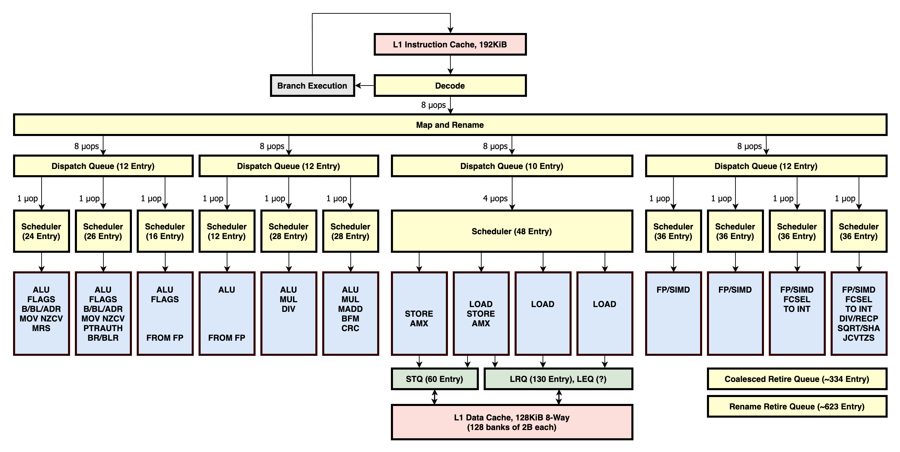
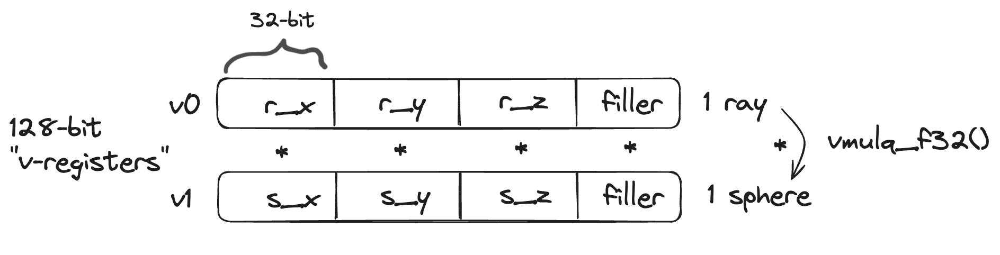
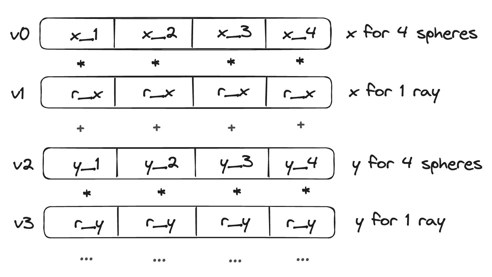
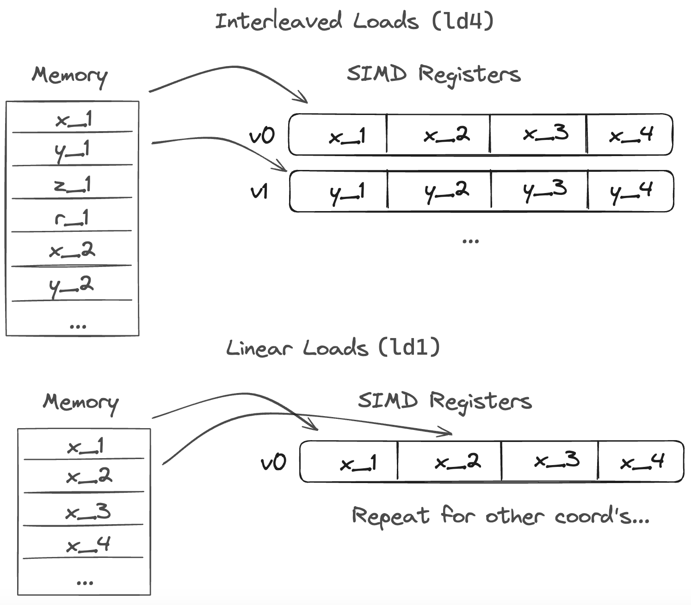

Ok, so I sort of buried the lede in the [last post](): after removing recursion the ray tracer renders the image in 37 seconds, a long ways from the 3+ hours [we started with](). By the end of this post it will get down to 24.7 seconds, a ~500x overall speedup. The main changes that led to this are:

| Improvement                 | Speedup |
| --------------------------- | ------- |
| Compiler optimization flag  | 15x     |
| Multithreading              | 6.2x    |
| SIMD                        | 2.4x    |
| Recursion                   | 1.5x    |
| Assorted other improvements | 1.3x    |

I talked about compiler optimization and recursion in past posts. Here I'll focus on SIMD&mdash;while it's not the biggest improvement, it's the one I found most interesting, and most challenging. But to understand it, we need to understand what the CPU is doing at a low-level.

### Four kinds of Parallelism

Modern computers have four kinds of parallelism:

1. Pipelining
2. Superscalar instruction-level parallelism
3. Single Instruction Multiple Data (SIMD)
4. Multi-core

I found "multi-core" to be the easiest to understand: most computers have multiple independent processor cores, and the operating system provides APIs to distribute a workload across them. My M2 MacBook Pro has 10 cores and I used `pthreads` to split my program into 10 threads, which the OS then schedules on different cores. It took me a few iterations to get multithreading working well. At first I split the calculation of a single pixel across threads, but there was too much overhead and blocking while each thread completed. Instead I split the overall render into the highest-level most-independent 10 chunks possible (based on scanlines), and enabled each thread to work on a chunk without communicating with other threads. This made the program run 6.2x faster[^0].

The other three kinds of parallelism are a bit more complicated, but are made much clearer with a diagram (below). When a CPU executes an instruction, it needs to perform multiple steps or stages: load the machine code from memory, translate it from bytes to an instruction ("decoding"), and then actually execute it (and there's more!). Executing an instruction usually involves doing operations with registers: either loading data from memory to a register (or vice versa), or doing arithmetic operations on values in registers.

*Diagram of the Apple M1 CPU ("Firestorm") microarchitecture, from [this incredible website](https://dougallj.github.io/applecpu/firestorm.html).*

*Pipelining* refers to a processor that split these stages into independent components. In any one clock cycle, multiple instructions can be processed simultaneously in different stages. An assembly line analogy is often used: while the first instruction is being executed, a second is being decoded, and a third is being fetched. In the microarchitecture diagram above, the amount of pipelining is shown vertically. Many modern CPUs have [10-20 pipeline stages](https://en.wikipedia.org/wiki/Comparison_of_CPU_microarchitectures).

*Superscalar* refers to a CPU that has multiple independent execution units (blue boxes above). This allows it to execute multiple instructions in the same cycle. In the diagram above, the amount of superscalar parallelism shows up in the width, and using the word "wide" to refer to a processor usually refers to the amount of instruction-level parallelism that can be achieved via independent execution units. Apple Silicon chips are noteworthy for how wide they are: an M1 performance core has 14 execution units!

*SIMD* refers to a specific type of hardware acceleration in which a processor can apply the same operation to multiple values in a single cycle. It does this by loading the data into wide registers, say stacking 8 32-bit floats side-by-side in a 256-bit register, and then doing an add operation on the entire register at once and treating each 32-bit "lane" as its own independent number. This is often called "vectorization". Different computers have different instruction sets for SIMD. My M2 is ARM and uses ARM's [Neon architecture](https://developer.arm.com/Architectures/Neon), which has 128-bit registers. Many Intel chips use the AVX SIMD architecture.

Modern CPUs have all four of these types of parallelism. My M2 (which I'm assuming has the same architecture and properties as a M1) has multiple cores; each core has multiple pipeline stages and 14 execution units; it includes 4 floating point execution units, each of which is able to do SIMD operations with 128-bit registers.

When I wrote my ray tracer in vanilla C, I was able to take advantage of pipelining and (to some extent) instruction-level parallelism without doing anything special. But to make the most of SIMD I needed to write specific code using Neon instructions[^1].

### A first attempt at SIMD

I focused my SIMD efforts on the innermost loop of my program that we looked at in Part 1 of this blog series: a ~10 line math routine that calculates the intersection between a ray and a sphere, and is executed about a trillion times:


point3_t center = sphere->center;
double radius = sphere->radius;
vec3_t a_c = subtract(r->origin, center);
double a = length_squared(&r->direction);
double half_b = dot(r->direction, a_c);
double c = length_squared(&a_c) - radius*radius;
double discriminant = half_b*half_b - a*c;
if (discriminant < 0) {
  return false;
} else {
   // do stuff
}

*This is derived [here](https://raytracing.github.io/books/RayTracingInOneWeekend.html#addingasphere/ray-sphereintersection), if you're curious about the math.*

The rays and spheres both consist of "vectors": the `{x,y,z}` coordinates of their positions and the ray's direction. I first tried to just stack these in SIMD registers "horizontally", so that instead of multiplying x\*x and y\*y and z\*z in three separate operations, I could do it in one:

I changed all my data types from `double` to `float` to fit each 3-vector into a 128-bit v-register with one lane to spare, padding my struct with a 4th value set to zero. After reading about NEON Intrinsics, the C functions that are essentially wrappers around SIMD instructions, I implemented a vectorized version of this routine:


float32x4_t origin = vld1q_f32(&r->origin.e[0]);
float32x4_t direction = vld1q_f32(&r->direction.e[0]);
float32x4_t center_vec = vld1q_f32(&center.e[0]);

float32x4_t a_c = vsubq_f32(origin, center_vec);
float32x4_t half_b_vec = vmulq_f32(direction, a_c);
float half_b = vaddvq_f32(half_b_vec); // horizontal sum
float32x4_t length_squared_vec = vmulq_f32(a_c, a_c);
float c = vaddvq_f32(length_squared_vec) - radius*radius;

float discriminant = half_b*half_b - c;
if (discriminant < 0) {
  return false;
} else {
  // do stuff
}


This was 14% faster than the scalar version, a much smaller improvement than the maximum-possible 4x speed-up I was naively hoping for. I was a bit discouraged and confused, but my initial impression was that moving data in and out of SIMD registers adds overhead, and I was only using three out of four lanes. I also couldn't figure out how to gracefully switch between vector operations and scalar operations. A dot product is a vector operation but it results in a scalar, and extracting and using that scalar meant I could no longer do SIMD operations. You can see the awkward and inefficient switching back and forth between scalar types (`float`) and vector types (float32x4_t` represents a SIMD register with four 32-bit floats).

### Four spheres at a time

Luckily there are [many](https://developer.arm.com/documentation/102159/latest/) [extensive](https://developer.arm.com/documentation/102467/0201/?lang=en) [guides](https://developer.arm.com/documentation/den0018/latest/) for optimizing code like this. I read through some examples and scoured the [intrinsics reference](https://developer.arm.com/architectures/instruction-sets/intrinsics). To make the most of SIMD, I wanted to translate my code into a single long block consisting exclusively of SIMD operations, avoiding branch conditions and horizontal operations. I also learned about "serial dependency chains": my processor has 4 floating point units, and ideally adjacent instructions are independent so the 4 units can execute them in parallel. But if the result of one instruction feeds into the next instruction, they are dependent and must be run one after another (ie. serially). Refactoring to avoid these dependencies allowed me to take advantage of the parallelism provided by my wide processor.

The routine above is inside of a loop that iterates over 500 spheres. Instead of vectorizing the calculation for a single sphere, I could instead use SIMD registers to do the calculation for four sphere's at once. I could load one vector with x's from four spheres, another with y's from four spheres, etc:

This changes the horizontal sum in our dot product into a vector addition, so four dot-products can be completed with 3 instructions (with fused multiply-add operations) instead of 8. The routine for 4 spheres now looks like:

// a_c = origin - center
float32x4_t ac_x = vsubq_f32(ray_orx, vec_spheres_xs.val[0]);
float32x4_t ac_y = vsubq_f32(ray_ory, vec_spheres_ys.val[0]);
float32x4_t ac_z = vsubq_f32(ray_orz, vec_spheres_zs.val[0]);

// half_b = direction dot a_c
float32x4_t halfb_x = vmulq_f32(ray_dirx, ac_x);
float32x4_t halfb_y = vmulq_f32(ray_diry, ac_y);
float32x4_t halfb_z = vmulq_f32(ray_dirz, ac_z);
float32x4_t halfb = vaddq_f32(halfb_x, halfb_y);
halfb = vaddq_f32(halfb, halfb_z);

// ... more code

// discriminant = half_b*half_b - c
float32x4_t disc = vmulq_f32(halfb, halfb);
disc = vsubq_f32(disc, c);


To break serial dependency chains, I unrolled the loop so each iteration handles 8 spheres: two identical calculations operating on different data. My first pass at implementing this improved the speed by 10%. A small step, but not revolutionary.

I got another 11% speedup from vectorizing the branch condition at the end of the loop. My first approach was to just iterate over each item in the discrimant vector, a scalar computation:

for (int i = 0; i < 4; i++) {
  if (disc[i] < 0) {
    continue;
  }
  // real work
}
// repeat again for 2nd set of 4 spheres

But we can avoid this whole ordeal if the entire vector is less than zero, and NEON has relatively efficient instructions for calculating the maximum within a vector. Doing this, first pairwise within the two vectors and then within that result, allows us to use SIMD for as long as possible and requires only one comparison operation (which has a low throughput):

if (vmaxvq_f32(vpmaxq_f32(disc, disc2)) < 0.0f) {
  sphere_pointer += 8;
  continue;
}

This compiles down to:

fmaxp.4s    v3, v14, v1
fmaxv.4s    s3, v3
fcmp        s3, #0.0
b.lt        0x100002b58 <_render_scanline+0x3c4>


You can see the two vectorized `max` operations that put the result in the scalar register `s3` (really just the first lane of `v3`) and the single `fcmp`. This serves as an early return to avoid the scalar branching logic.

I now turned my attention to data loading. My first attempt was cumbersome: in each loop iteration I rearranged four spheres in memory to load them into the register in the right form. After reading more docs, I found NEON has instructions to do interleaved loads. If you have an array of structs containing four values, there is a single instruction that can de-interleave the data as it loads it into SIMD registers. My spheres were stored in an array of structs, each of which looked like:

typedef struct sphere_t {
  point3_t center; // equivalent to float x, y, z;
  float radius;
  material_t *material;
} sphere_t;

If I moved the sphere's material into a separate array then I could load the x, y, z, and radius for four spheres into four SIMD registers with a single instruction:

float32x4x4_t vec_spheres = vld4q_f32(&this_sphere->center.e[0]);

which compiles down to the following assembly:

ld4.4s  { v20, v21, v22, v23 }, [x15]


This improved performance by 23%, bringing the total speed-up from SIMD to 1.71x.

### Direct Data Loads and Instruction-level Parallelism

At this point, and after figuring out the recursion L1 cache miss problem, my ray tracer ran in 37 seconds. But the performance counter metrics still showed some oddities. The \# of floating point uops / cycle was 3.0 but the theoretical max should be closer to 4.0[^2]. And 30% of cycles had pipeline stalls - what's up with that?

I went back to the drawing board. It felt like I still had a data dependency problem but I couldn't figure out where. I did more research on performance engineering and came across [this textbook](https://en.algorithmica.org/hpc/). One of the most helpful parts was the worked examples, such as [this example](https://en.algorithmica.org/hpc/algorithms/gcd/) where they analyze a serial dependency chain (see diagram near bottom of page) and show how refactoring the code breaks the chain apart. I found similar inspiration in [this section](https://en.algorithmica.org/hpc/pipelining/throughput/) that explains how to analyze instruction throughput.

So I took a closer look at the instruction tables for Apple Silicon. The only place in the whole wide internet that had this information was the same source as the microarchitecture diagram about: [@dougallj's](https://mastodon.social/@dougall) [Apple CPU page](https://dougallj.github.io/applecpu/firestorm.html), which is both comprehensive and incredibly detailed. In scanning through the instruction table there, I realized the "interleaved load" instruction I was using (`ld4`) had horrible performance! It's reciprocal throughput is a full 2 cycles/instruction (the cheapest instructions are 8x better), and critically it requires the floating point units for 8 uops. There had to be a better way.

I didn't have to dig much to find one. Instead of loading interleaved data I could do a direct "linear" load: 8 contiguous floats in memory are loaded into two SIMD registers using the `ld1.4s` instruction. I'd have to do this 4x to load all 8 spheres into memory (as opposed to only 2x for the interleaved load), but the instruction has a reciprocal throughput of 0.67 and doesn't using the floating point units at all!

This was perfect: my program was mostly constrained by floating point operations. By offloading the data loads to the memory execution units, they would run in parallel and free up the floating point units to do the actual math. Instruction-level parallelism![^3]

Implementing this required refactoring my data model *yet again*. I made a 4 arrays: one for every sphere's x-coordinate, another for y's, etc. After this the big image rendered in 25.4 seconds, a 40% improvement. Here's the assembly for this final version of the inner loop:


ld1.4s  { v0, v1 }, [x30], #32
ld1.4s  { v17, v18 }, [x0], #32
ld1.4s  { v5, v6 }, [x1], #32
ld1.4s  { v8, v9 }, [x19], #32
fsub.4s v14, v29, v0
fsub.4s v3, v30, v17
fsub.4s v16, v31, v5
fsub.4s v1, v29, v1
fsub.4s v17, v30, v18
fsub.4s v5, v31, v6
fmul.4s v12, v14, v25[0]
fmla.4s v12, v27, v3
fmla.4s v12, v28, v16
fmul.4s v0, v1, v25[0]
fmla.4s v0, v27, v17
fmla.4s v0, v28, v5
fmul.4s v6, v14, v14
fmla.4s v6, v3, v3
fmla.4s v6, v16, v16
fmla.4s v8, v12, v12
fsub.4s v14, v8, v6
fmul.4s v1, v1, v1
fmla.4s v1, v17, v17
fmla.4s v1, v5, v5
fmla.4s v9, v0, v0
fsub.4s v1, v9, v1
fmaxp.4s        v3, v14, v1
fmaxv.4s        s3, v3
fcmp    s3, #0.0
b.lt    0x100002b58 <_render_scanline+0x3c4>


You can see the four linear loads (`ld1`) that load 8 floats into 2 vectors each, a series of math computations (two iterations of the loop unrolled), and then the reduce operation at the bottom.

Before getting sucked into this performance optimization exercise, I thought that performant code was clean and short and well-organized. But that's not true at all! Many of these optimizations made the code more confusing and *added* lines of code. It's less about the number of instructions and more about their latency and throughput characteristics and the topology with which they run on the CPU.

### Metrics, again

I ran another profile to better understand how the linear data loads made it so much faster. I expected the \# of floating point uops/cycle to go up, now that memory loads can run in parallel instead of clogging up the floating point units. I also suspected the map pipeline stalls&mdash;the fraction of cycles in which the map unit could not send instructions to dispatch queues&mdash; would drop significantly. Neither of those things happened!

|                               | Interleaved Data Loads | Linear Data Loads |
| ----------------------------- | ---------------------- | ----------------- |
| Runtime                       | 37 seconds             | 24.7 seconds      |
| Instructions / cycle          | 2.5                    | 3.7               |
| Floating Point uops / cycle   | 3.0                    | 2.7               |
| % of Cycles w/Pipeline Stalls | 34%                    | 32%               |

The instructions/cycle is the top-level metric showing the amount of instruction-level parallelism, and that did increase significantly, so the new data loads did lead to more efficiency. The drop in floating point uops/cycle makes sense in hindsight: the interleaved loads ensured the floating point units were filled to the brim for 4 cycles. If this metric is essentially an average across many sequences of code, we're lowering that average by replacing those instructions with others FP operations that execute less efficiently. My understanding is theoretically this metric would be 4 if all floating point execution units were used as efficiently as possible. This suggests there's still some headroom. And I have no idea about the pipeline stalls -- they must be caused by something else[^4].

While I've learned a lot about interpreting these numbers, I'm still not sure how to recognize if this is as fast as it can go, or if there's more opportunities for optimization.

As a post-script, to further probe the cause of the 2.7 fp ops/cycle I tried unrolling my loop more and less. Removing any loop unrolling (4 spheres/iteration instead of 8) makes it 10% slower but doubling it (16 spheres/iteration instead of 8) also made it 5% slower. So it seems like I'm already in a sweet spot for serial dependency chains.

Do you have ideas to make this go faster? Do you have advice on identifying performance opportunities from metrics? Let me know!

And all the code can be found on [my github](https://github.com/JFeintzeig/ray_tracer).

[^0]: I naively expected a 10x speed-up because I have 10 cores, but later realized that (as I mentioned in the last post) my cores are not homogenous. As far as I can tell, each of the 6 "performance cores" are roughly twice as powerful as each of the 4 "efficiency cores". Also, the recursion-cache-miss problem only appeared when running on multiple cores, so I think some of that speed-up can also be attributed to having multiple cores.
[^1]: Compilers can also vectorize code automatically, but writing SIMD code by hand is often required to get the most performance for a computationally-intensive routine. Similarly, carefully crafted code can improve instruction-level parallelism.
[^2]: It's slightly more complicated because the efficiency cores only have 2 floating point units. But looking at only the performance cores I was running 3.6 FP uops/cycle with a theoretical max of 4.
[^3]: While I felt smart for figuring this out on my own, in hindsight I realized the NEON programmer guide clearly states that direct loads are faster than interleaved loads...*groan*. Oh well, it was more fun this way.
[^4]: Other metrics show 80% of pipeline stalls are caused by "dispatch backpressure", which suggests the back-end of the CPU (e.g. the execution units) is clogged up and causing the stall. It's possible this is just caused by the program being dominated by FP operations: e.g. if the mappers send the max of 8uops to the FP queues each cycle but the FP units can only execute 4 uops. But combined with the sub-par FP ops/cycle, my hunch is something else is going on. The other 20% must be front-end latency (maybe instruction fetching? branch mis-prediction? I'm not sure). 
